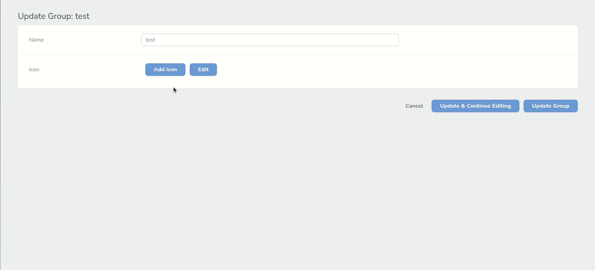
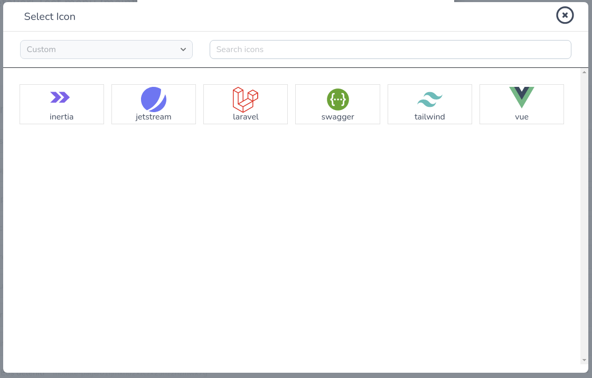

# Heroicon Nova Field

A Laravel Nova Field for managing icons. [Heroicons](https://heroicons.com/) used by default.
Custom sets of icons can be registered and used with or instead heroicons, each icon can be changed via editor. Icon saved as svg html tag into db.

## Installation:

Use composer for installation. Laravel with nova required.

```bash
composer require alexazartsev/heroicon
```

## Usage:

Use it as regular nova field:

```php
use AlexAzartsev\Heroicon\Heroicon;

Heroicon::make('Icon');
```

To use custom or customize existing icon click on `Edit` button and just edit svg code of selected icon:



To register custom set of icons use global or local configuration discribed below:



## Configuration:

### Global configuration:

Field can be configured globally in `NovaServiceProvider`:

```php
namespace App\Providers;

use AlexAzartsev\Heroicon\Heroicon;

class NovaServiceProvider extends NovaApplicationServiceProvider
{
    ...
    public function boot()
    {
        parent::boot();
        
        // to register set of icons globally, just specify folder with svg icons like this:
        // (icons should be located directly in specified folder in .svg format)
        // 'custom' icon set will be available for every Heroicon in your app
        Heroicon::registerGlobalIconSet('custom', 'Custom Icons', resource_path('img/icons'));
        // to pick default icon sets that will be available on field all over app use this:
        // default sets available: 'solid','outline'
        Heroicon::defaultIconSets(['solid', 'custom']);
        // to make svg editor disabled by default for every field use this:
        Heroicon::defaultEditorEnable(false);

    }
```

### Local configuration:

To disable svg editor of the icon:

```php
use AlexAzartsev\Heroicon\Heroicon;

Heroicon::make('Icon')->disableEditor();
```

To register custom set of icons (icons should be located directly in specified folder in .svg format):

```php
use AlexAzartsev\Heroicon\Heroicon;

Heroicon::make('Icon')->registerIconSet('custom', 'Custom', resource_path('img/icons'));
```

To allow certain sets of icons:

```php
use AlexAzartsev\Heroicon\Heroicon;

Heroicon::make('Icon')->only(['custom', 'solid']);
//for default sets you can use these methods:
Heroicon::make('Icon')->onlySolid();
Heroicon::make('Icon')->onlyOutline();
```

## Support:

alex.azarsecond@gmail.com

## License:

The MIT License (MIT). Please see [License File](LICENSE) for more information.
