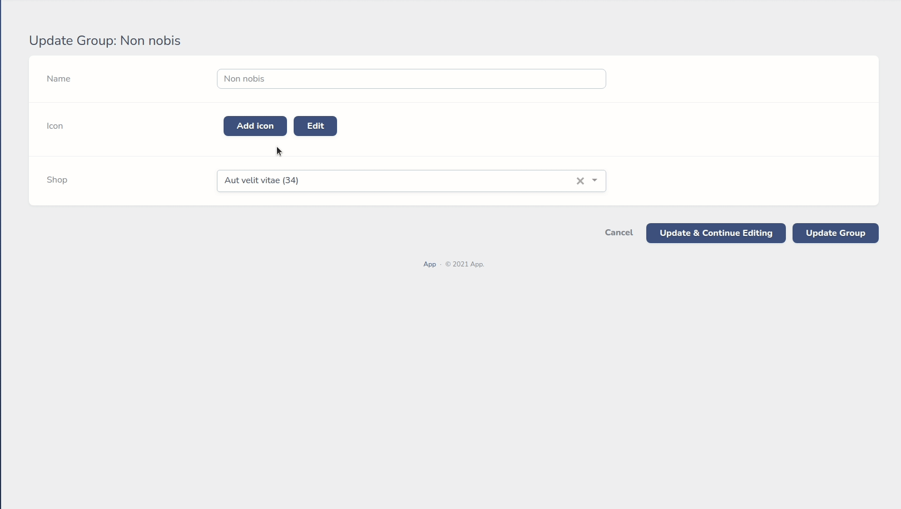

# Fork

* Completed translations
* Add configuration
* Remove non performant `all icons` selection

### `composer.json`

```json
    "repositories": [
        {
        "type": "vcs",
        "url": "https://github.com/Muetze42/nova-icon"
        }
    ],
```

### config:

`php artisan vendor:publish --provider="AlexAzartsev\Heroicon\FieldServiceProvider"`

### Nova translations

```json
{
    "Close": "Close",
    "Edit": "Edit",
    "Change icon": "Change icon",
    "Add icon": "Add icon",
    "Select Icon": "Select Icon",
    "Search icons": "Search icons"
}
```

---
# Heroicon Nova Field

A Laravel Nova Field for managing icons. [Heroicons](https://heroicons.com/) and free [Font Awesome](https://fontawesome.com/) supported out of the box,
pro version of Font Awesome can be registered as custom set of icons.

Custom sets of icons can be registered globally for each field or locally for concrete field instanse and used with or instead default sets.

Each icon can be changed via editor.

Icon saved as svg html tag into db.

## Installation:

Use composer for installation. Laravel with nova required.

```bash
composer require alexazartsev/heroicon
```

## Usage:

Use it as regular nova field:

```php
use AlexAzartsev\Heroicon\Icon;

Icon::make('Icon');
```
### Default icon sets available:

| Name       | Label                | Icons                                                                                      |
|------------|----------------------|--------------------------------------------------------------------------------------------|
| solid      | Heroicons solid      | [Heroicons solid](https://heroicons.com/)                                                  |
| outline    | Heroicons outline    | [Heroicons outline](https://heroicons.com/)                                                |
| fa-brands  | Font Awesome brands  | [Font Awesome brands](https://fontawesome.com/v5.15/icons?d=gallery&p=2&s=brands&m=free)   |
| fa-solid   | Font Awesome solid   | [Font Awesome solid](https://fontawesome.com/v5.15/icons?d=gallery&p=2&s=solid&m=free)     |
| fa-regular | Font Awesome regular | [Font Awesome regular](https://fontawesome.com/v5.15/icons?d=gallery&p=2&s=regular&m=free) |


To use custom or customize existing icon click on `Edit` button and just edit svg code of selected icon:




To register custom set of icons use global or local configuration discribed below:

## Configuration:

### Global configuration:

Field can be configured globally in `NovaServiceProvider`:

```php
namespace App\Providers;

use AlexAzartsev\Heroicon\Icon;

class NovaServiceProvider extends NovaApplicationServiceProvider
{
    ...
    public function boot()
    {
        parent::boot();
        
        // to register set of icons globally, just specify folder with svg icons like this:
        // (icons should be located directly in specified folder in .svg format)
        // 'custom' icon set will be available for every Heroicon in your app
        Icon::registerGlobalIconSet('custom', 'Custom Icons', resource_path('img/icons'));
        // to pick default icon sets that will be available on field all over app use this:
        // default sets available: 'solid', 'outline', 'fa-brands', 'fa-regular', 'fa-solid'
        Icon::defaultIconSets(['solid', 'fa-brands', 'custom']);
        // to make svg editor disabled by default for every field use this:
        Icon::defaultEditorEnable(false);

    }
```

### Local configuration:

To disable or enable svg editor of the icon:

```php
use AlexAzartsev\Heroicon\Icon;

Icon::make('Icon')->disableEditor();
Icon::make('Icon')->enableEditor();
```

To register custom set of icons (icons should be located directly in specified folder in .svg format):

```php
use AlexAzartsev\Heroicon\Icon;

Icon::make('Icon')->registerIconSet('custom', 'Custom', resource_path('img/icons'));
```

To allow certain sets of icons:

```php
use AlexAzartsev\Heroicon\Icon;

Icon::make('Icon')->only(['custom', 'solid']);
//for default sets you can use these methods:
Icon::make('Icon')->onlySolid();
Icon::make('Icon')->onlyOutline();
Icon::make('Icon')->onlyFaBrands();
Icon::make('Icon')->onlyFaSolid();
Icon::make('Icon')->onlyFaRegular();
```

## Support:

alex.azarsecond@gmail.com

## License:

The MIT License (MIT). Please see [License File](LICENSE) for more information.

[](https://vshymanskyy.github.io/StandWithUkraine/)
[](https://linktr.ee/CurrentPetitionsFreeIran)
